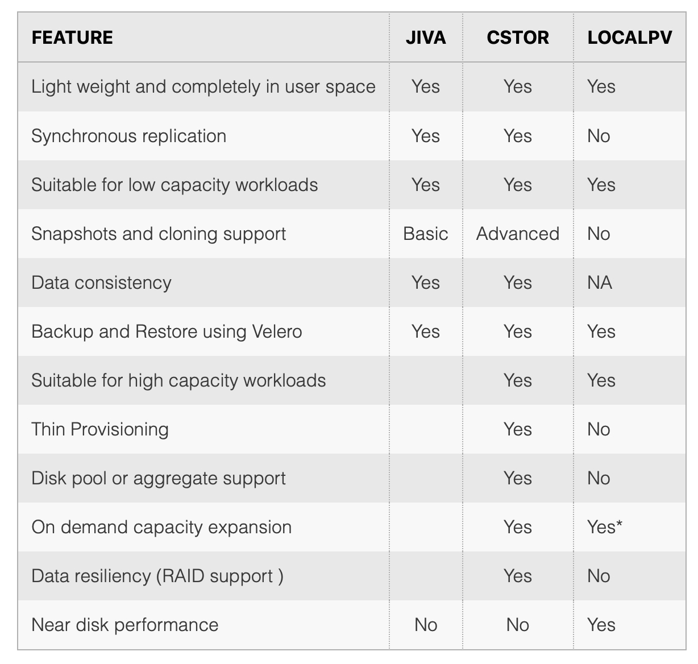

### OpenEBS

OpenEBS is a Cloud Native software defined storage solution that enable us to use several storage options (disks, SSDs, cloud volumes, etc) and use them to dynamically provision Kubernetes Persistent Volumes. This prevents Cloud Lock-in, enables custom Storage classes per workload, Replication, Clones and Snapshots.

* Container-attached and container-native storage on Kubernetes.
* Each workload is provided with a dedicated storage controller.
* Implements granular storage policies and isolation.
* Completely in userspace making it highly portable.
* Volumes provisioned through OpenEBS are always containerized and represented as a pod.
* OpenEBS is a collection Storage Engines.
    * [Jiva](./openebs/Jiva/README.md)
    * [cStor](./openebs/cStor/README.md)
    * [LocalPV-hostpath](./openebs/LocalPV/hostpath/README.md)
    * [LocalPV-device](./openebs/LocalPV/device/README.md)


## Engines Comparison   



## Prerequisites (iSCSI client)

* Depending on kubernetes provider or solution with need to setup the iSCSI client
* https://docs.openebs.io/docs/next/prerequisites.html
* Usually there is no need.

## Default OpenEBS Setup on Kubernetes
```
kubectl create namespace openebs
helm repo add openebs https://openebs.github.io/charts
helm repo update
helm install --namespace openebs openebs openebs/openebs
```

## Important node
* Whe we setup the OpenEBS storage on the cluster the cloud default/standard provider will not work.
* In all sts and in the helm charts wehave to set the sc.

### Node Device Manager(NDM) 
* Is an important component in the OpenEBS architecture. NDM treats block devices as resources that need to be monitored and managed just like other resources such as CPU, Memory and Network. It is a daemonset which runs on each node, detects attached block devices based on the filters and loads them as block devices custom resource into Kubernetes. These custom resources are aimed towards helping hyper-converged Storage Operators by providing abilities like:

* Easy to access inventory of Block Devices available across the Kubernetes Cluster.
* Predict failures on the Disks to help with taking preventive actions.
* Allow dynamically attaching/detaching disks to a storage pod, without restarting the corresponding NDM pod running on the Node where the disk is attached/detached.
* NDM daemon runs in containers and has to access the underlying storage devices and run in Privileged mode. 

* The Node Device Manager (NDM) is an important component of the OpenEBS control plane. Each node in the Kubernetes cluster runs an NDM DaemonSet which is responsible for discovering the new block storage devices and if they match the filter, it reports it to the NDM operator to register that as a block device resource. NDM acts as the conduit between the control plane and the physical disks attached to each node. It maintains the inventory of registered block storage devices in the etcd database which is the single source of truth for the cluster.

## References
* https://docs.openebs.io/docs/next/ndm.html


### mayactl
* The mayactl is the command line tool for interacting with OpenEBS volumes and Pools. The mayactl is not used or required while provisioning or managing the OpenEBS volumes, but it is currently used while debugging and troubleshooting. OpenEBS volume and pool status can be get using the mayactl command.
* For getting access to mayactl command line tool, you have to login or execute into the maya-apiserver pod on Kubernetes.


## References
* https://docs.openebs.io/docs/next/mayactl.html


### Maya online
* You can use the SaaS platform to monitor your openebs storage layer, metrics and logs.

## References:
* https://director.mayadata.io/


